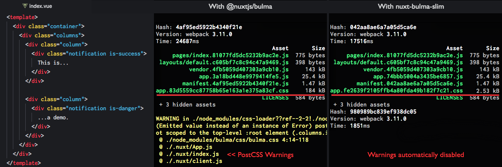

# nuxt-bulma-slim

[Nuxt.js](https://nuxtjs.org) module to automatically make a slim
[Bulma](https://bulma.io) build of used features with
[Purgecss](https://www.purgecss.com). Simply drop in this module and
save precious kilobytes. Also gets rid of annoying warnings for you.




## Setup

Install the dependency:

```shell
npm install nuxt-bulma-slim
```

Add it to the `modules` section of `nuxt.config.js`:

```javascript
{
  modules: [
    'nuxt-bulma-slim'
  ]
}
```

Or with custom options:

```javascript
{
  modules: [
    [
      'nuxt-bulma-slim',
      {
        variablesPath: 'assets/scss/my-variables.scss',
        additionalPaths: ['assets/scss/component-styles.scss']
      }
    ]
  ]
}
```


## Options

### `srcGlobs`

This is an Array of glob paths. These paths can be absolute or relative to the
Nuxt App `srcDir` option. The Array is passed to Purgecss'
[`content`](https://www.purgecss.com/configuration.html#content) option.

#### Default

```javascript
srcGlobs = [
  '<Nuxt App srcDir>/layouts/**/*.vue',
  '<Nuxt App srcDir>/pages/**/*.vue',
  '<Nuxt App srcDir>/components/**/*.vue'
]
```

### `variablesPath`

This is a String of a path to a `.sass`/`.scss` file that contains variables.
Use this file to overwrite
[Bulma's variables](https://bulma.io/documentation/overview/variables).

Note that the path can be absolute or relative to the Nuxt App `srcDir` option
and must be a `.sass` or `.scss` file.

For convenience this module checks if one of these files exists and
automatically set the `variablesPath` option if you haven't set it already:

- `<Nuxt App srcDir>/assets/sass/variables.sass`
- `<Nuxt App srcDir>/assets/scss/variables.scss`

#### Default

```javascript
variablesPath = null // if none of the above files exist, or ...
variablesPath = '<Nuxt App srcDir>/assets/sass/variables.sass' // or ...
variablesPath = '<Nuxt App srcDir>/assets/scss/variables.scss'
```

### `sassTempPath`

This is a String of a path to the temporary `.sass` file that will be consumed
by Nuxt.

#### Default

```javascript
sassTempPath = '<OS temp dir>/nuxt-bulma-slim.sass'
```

### `cssTempPath`

This is a String of a path to the temporary `.css` file that will be consumed
by Nuxt.

#### Default

```javascript
cssTempPath = '<OS temp dir>/nuxt-bulma-slim.css'
```

### `disablePostCSSWarnings`

This is a Boolean to disable PostCSS warnings when compiling Bulma's SASS to
CSS. If `true`, it will set this option in the Nuxt settings:

```javascript
{
  build: {
    postcss: {
      plugins: {
        'postcss-custom-properties': {
          warnings: false
        }
      }
    }
  }
}
```

Check out the [related issue](https://github.com/nuxt/nuxt.js/issues/1670).

#### Default

```javascript
disablePostCSSWarnings = true
```

### `whitelist`

This is an Array of whitelisted selectors and is given to Purgecss'
[`whitelist`](https://www.purgecss.com/configuration.html#whitelist) option.

Note that `html` and `body` are already whitelisted by this module.

#### Default

```javascript
whitelist = []
```

### `whitelistPatterns`

This is an Array of whitelisted selectors based on RegEx and is given to
Purgecss'
[`whitelistPatterns`](https://www.purgecss.com/configuration.html#whitelistpatterns)
option.

#### Default

```javascript
whitelistPatterns = []
```

### `additionalPaths`

This is an Array of additional `.sass`/`.scss`/`.css` paths that will be bundled
along with the `variablesPath` and the Bulma build. This is useful if you want
to bundle 3rd party libraries like [Buefy](https://buefy.github.io) that depend
on Bulma.

#### Default

```javascript
additionalPaths = []
```


## How does it work?

In development mode (`nuxt dev`) a temporary `.sass` file is written with your
defined `variablesPath`, the complete Bulma features, and any `additionalPaths`.

This `.sass` file is then injected into the
[`css`](https://nuxtjs.org/api/configuration-css) Array of Nuxt. Since Nuxt can
compile SASS, it will also automatically hot-reload your styles when you change
your variables or additional paths content.

In production mode (`nuxt build`/`nuxt start` & `nuxt generate`), this module
will bundle the SASS just like in development. Additionally it will compile the
SASS to CSS.

This CSS is then run thru Purgecss to minify it, then it is written to a
temporary `.css` file and injected into Nuxt's `css` Array.


## Development

#### `npm test`

Run all the tests.

#### `npm run test:watch`

Re-run specific tests on file changes.

#### `npm run lint`

Lint all the code.

#### `npm run dev`

Run the `./example` Nuxt App in dev mode (will use the whole Bulma library).

#### `npm run build`

Build the example Nuxt App (will only bundle Bulma features that are used).

#### `npm start`

Will start the example Nuxt App in production.
